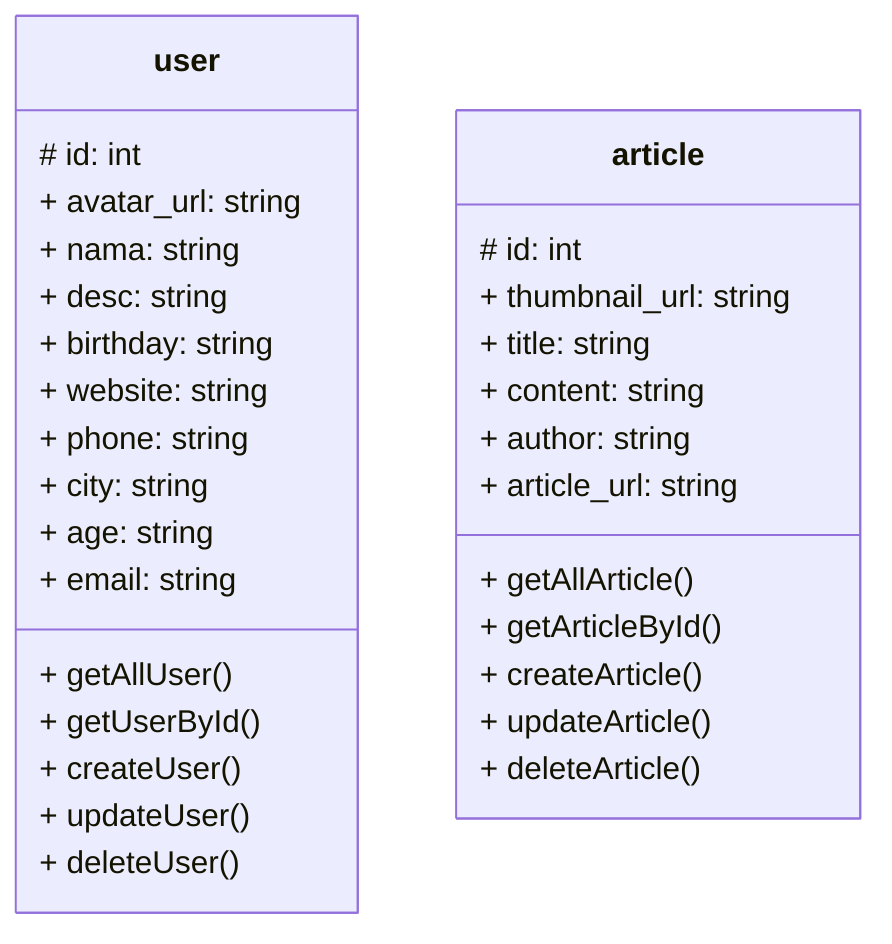

## API POINTS
Adapun api point yang saya bangun untuk portfolio saya di antaranya user dan article

## User

berikut adalah design controller user yang dimana berperan ketika kita hendak mengambil data dari api server
di antaranya:
`getAllUser()`, `getUserById`, `createUser()`, `updateUser()`, `deleteUser()`.

> getAllUser()

getAllUser adalah fungsi untuk mendapatkan data seluruh user dari server database

```
GET: /user

response:
[
    {
        "id"            : "",
        "avatar_url"    : "",
        "nama"          : "",
        "desc"          : "",
        "birthday"      : "",
        "website"       : "",
        "phone"         : "",
        "city"          : "",
        "age"           : "",
        "email"         : ""
    },
    ...
]
```

> getUserById()

getUserById sendiri merupakan fungsi untuk mendapatkan user berdasarkan `id`

```
GET: /user/[id]

response:
{
    "id"            : "",
    "avatar_url"    : "",
    "nama"          : "",
    "desc"          : "",
    "birthday"      : "",
    "website"       : "",
    "phone"         : "",
    "city"          : "",
    "age"           : "",
    "email"         : ""
}
```

> createUser()

createUser adalah fungsi untuk membuat data baru yang disimpan ke server di api point server 

```
POST: /user

headers:
{
    Content-type: 'application/json',
    Authorization: 'Bearer [access_token]'
}

body:
{
    "avatar_url"    : "",
    "nama"          : "",
    "desc"          : "",
    "birthday"      : "",
    "website"       : "",
    "phone"         : "",
    "city"          : "",
    "age"           : "",
    "email"         : ""
}

response:
true    // if success
false   // if failure
```

> updateUser()

updateUser merupakan fungsi untuk mengubah data pada api server

```
PUT: /user

headers:
{
    Content-type: 'application/json',
    Authorization: 'Bearer [access_token]'
}

body:
{
    "id"            : "",
    "avatar_url"    : "",
    "nama"          : "",
    "desc"          : "",
    "birthday"      : "",
    "website"       : "",
    "phone"         : "",
    "city"          : "",
    "age"           : "",
    "email"         : ""
}

response:
true    // if success
false   // if failure
```

> deleteUser()

deleteUser merupakan fungsi untuk menghapus data user pada server api

```
DELETE: /user/[id]

headers:
{
    Content-type: 'application/json',
    Authorization: 'Bearer [access_token]'
}

response:
true    // if success
false   // if failure
```

## Article

Kemudian berikut adalah design controller article yang berfungsi untuk memanggil data article dari server api
di antarnya:
`getAllArticle()`, `getArticleById()`, `createArticle()`, `updateArtcile()`, `deleteArticle()`.

> getAllArticle()

getAllArticle adalah fungsi untuk mendapatkan data seluruh article dari api server

```
GET: /article

response:
[
    {
        "id"                : "",
        "thumbnail_url"     : "",
        "title"             : "",
        "content"           : "",
        "author"            : "",
        "article_url"       : "",
    },
    ...
]

```

> getArticleById()

getArticleById adalah fungsi untuk medapatkan data article berdasarkan `id`

```
GET: /article/[id]

response:
{
    "id"                : "",
    "thumbnail_url"     : "",
    "title"             : "",
    "content"           : "",
    "author"            : "",
    "article_url"       : "",
},
```
> createArticle()

createArticle adalah fungsi untuk manambahkan data article ke server api

```
POST: /article

header:
{
    Content-type: 'application/json',
    Authorization: 'Bearer [access_token]'
}

body:
{
    "thumbnail_url"     : "",
    "title"             : "",
    "content"           : "",
    "author"            : "",
    "article_url"       : "",
},

response:
true    // if success
false   // if failure
```
> updateArtcile()

updateArticle adalah fungsi untuk mengubah data pada server yang telah ada pada article

```
PUT: /article

header:
{
    Content-type: 'application/json',
    Authorization: 'Bearer [access_token]'
}

body:
{
    "id"                : "",
    "thumbnail_url"     : "",
    "title"             : "",
    "content"           : "",
    "author"            : "",
    "article_url"       : "",
},

response:
true    // if success
false   // if failure
```
> deleteArticle()

deleteArticle adalah fungsi untuk menhapus data article yang telah ada pada server api

```
DELETE: /article/[id]

headers:
{
    Content-type: 'application/json',
    Authorization: 'Bearer [access_token]'
}

response:
true    // if success
false   // if failure
```

## Desain Database

Berikut adalah pola design dari database saya:


